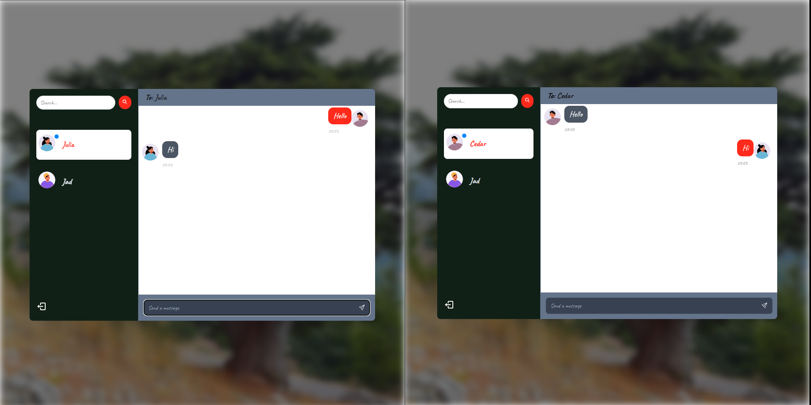

# MERN Lebanese styled Chat app with Socket io

## Overview

A chat app built with the MERN stack (MongoDB, Express.js, React, Node.js) and Socket.io for real time communication. Including user authentication, Zustand for global state management, and dynamic profile pictures.

---

## Preview Image



## Features

- **Real-Time Chat**: Using Socket.Io
- **User Authentication**: Sign up and login with password encryption using bcrypt.js.
- **Global State Management**: Zustand manages state and stores user cookies in local storage.
- **Profile Pictures**: Generated using the [Avatar placeholder Api](https://avatar-placeholder.iran.liara.run/).

---

## Technologies

- **Frontend**: React, Zustand, Socket.Io Client
- **Backend**: Node.js, Express.js, Socket.IO
- **Database**: MongoDB
- **Authentication**: bcrypt.js

---

## Installation

1. **clone the repo**:
   ```bash
   git clone https://github.com/Sm3ha-git/ChatApp-LB.git
   cd ChatApp-LB
   ```
2. **set up your .env file**:

```bash
   PORT=5000
MONGO_DB_URI= ...
JWT_SECRET= ...
NODE_ENV= ...
```

3. **build and start the app**

```bash
npm run build
npm run start
```

4. **Note**
   Also change the url in the socketManager.jsx file to match that of your backend port
